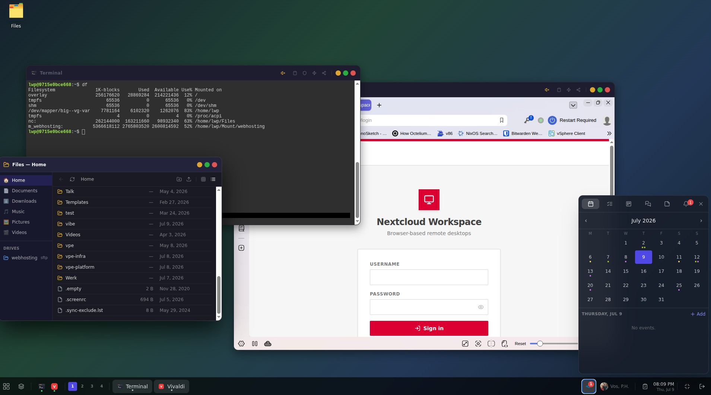

# Nextcloud Linux Workspace (LWP)

> **Proof of Concept.** This is a working POC, not a hardened production release — code and APIs may change without notice, and it hasn't had a full security audit. Everything below is implemented and runnable, but treat it as a demo/evaluation build.

A browser-based remote desktop — a Kasm alternative built on a custom VNC stack with a full windowed desktop experience, deeply integrated with Nextcloud. Log in once and get a full Linux desktop (or individual apps) running in isolated containers, streamed to the browser, with your Nextcloud storage mounted everywhere.

**What you can do with it:**
- Spin up disposable Linux desktops or single apps (browser, office suite, terminal, IDE, …) per user, no client install
- Give every session instant access to a Nextcloud account — files, calendar, tasks, chat — mounted or embedded directly
- Add your own app images and roll them out through an admin-managed catalog
- Run it behind your own SSO (OIDC/LDAP/local) and your own TLS, on Docker Compose for a quick try or Kubernetes for a real deployment

See [Features](#features) below for the full list, or [docs/architecture.md](docs/architecture.md) for how it fits together.



## Stack

| Layer | Technology |
|---|---|
| **Frontend** | React 18, Vite, TypeScript, Tailwind, shadcn/ui, TanStack Query, Zustand |
| **Backend** | FastAPI (Python 3.12), SQLAlchemy 2 async, Alembic, ARQ |
| **Database** | PostgreSQL 16 |
| **Cache / queue** | Redis 7 |
| **Proxy** | Nginx — `auth_request` session routing, strips `/session/<token>/` prefix |
| **Desktop apps** | VNC over WebSocket — KasmVNC HTML5 client. Base `lwp-kasm-base` — Ubuntu 24.04 + KasmVNC (8080) + PulseAudio + ffmpeg Opus audio (8081) + supervisord |
| **Web-native apps** | App serves its own UI over HTTPS, proxied directly (no VNC). Base `lwp-web-base` — nginx TLS wrapper; or the app does its own TLS (code-server, ttyd) |
| **Auth** | OIDC (SSO), local username/password, LDAP/Active Directory; single-session takeover |
| **Storage** | rclone WebDAV (Nextcloud) with VFS full-cache mode + user SFTP/S3 mounts (key or password) |
| **Observability** | Prometheus `/metrics`, audit log, per-app/user analytics |
| **Deploy** | Kubernetes (prod, with PDBs + nightly pg_dump), Docker Compose (dev/test) |

## Quick start (Docker Compose)

```bash
git clone <repo> lwp && cd lwp

cp compose/.env.example compose/.env
# Edit compose/.env — at minimum set AUTH_METHODS and OIDC_* vars
# (see docs/auth-setup.md for local/LDAP/OIDC provider instructions)

make dev
# → http://localhost
```

First user to log in automatically becomes admin.

## Features

### Desktop
- **Windowed desktop** — draggable, resizable windows with snap zones (left/right half, maximise)
- **Window management** — minimise, maximise, cascade; Alt+Tab switcher; Mission Control (Exposé)
- **Workspaces** — 4 virtual desktops; windows stay mounted (no reconnect on switch)
- **App launcher** — categorised grid, search, drag app to taskbar to pin
- **Taskbar quick launch** — pin apps by dragging from launcher or right-click → "Pin to taskbar"
- **Desktop icons** — pin apps to the desktop background
- **Wallpaper picker** — CSS gradients + custom image URL
- **Dark / light / system theme**
- **Preferences persisted** — wallpaper, theme, layout, quick launch, logout choice saved in PostgreSQL

### Sessions
- **One-click launch** — session starts as a Docker container / K8s pod
- **Auto-close** — window closes automatically when the app exits
- **Idle suspend** — sessions pause after 15 min inactivity, resume on activity (idle tracked *inside* the session iframe too, not just the top window)
- **Background Terminal** — opt-in (Profile): Terminal survives idle, window close, and closed tabs — jobs keep running in its persistent `screen` session for up to 48 h; relaunching reattaches
- **Reconnect / health** — liveness ping + "Connection lost → Reconnect" overlay
- **Drag-drop file transfer** — drop a file on the session viewer → uploads to `~/Files`
- **Shared clipboard** — bridges copy/paste **between all apps** (VNC *and* web) — see Clipboard below
- **Mute** — per-window mute button
- **Session limits** — per-user cap, per-group quotas, idle auto-reap + max lifetime

### Apps (catalog)
- **Desktop apps (VNC)** — Firefox, Vivaldi, Thunderbird, LibreOffice, Terminator (+ opencode TUI, node/nvm), SSHPilot, VSCodium, OpenCode (desktop app), Headlamp, FileZilla, Remmina, Ferdium
- **Web-native apps (no VNC — lighter, crisper)** — Terminal (ttyd + ssh/kubectl/k9s/bao, node/nvm, ruff/yamllint/jsonlint), JupyterLab, pgweb, htop, VPN
- The start menu **badges** apps *Web* vs *Desktop* and groups them; admins toggle `web_native` per app
- **Add your own** — VNC app = `FROM lwp-kasm-base` + install; web app = `FROM lwp-web-base` (TLS wrapper, handles the session prefix) or serve your own TLS. See [docs/apps.md](docs/apps.md)

### Audio
- **Independent Opus/Ogg stream** (KasmVNC 1.4's client can't play audio standalone): a PulseAudio null sink → `ffmpeg` serves the sink monitor on the container's `:8081`; the backend relays it (`GET /api/sessions/{id}/audio`) to a hidden `<audio>` element.
- Per-window **mute** (default) + a titlebar **volume slider** (reveals on hover). No browser plugins; works in Chrome and Firefox.

### Storage & Nextcloud
- **Nextcloud WebDAV** — rclone FUSE mount with `--vfs-cache-mode full`; mounted in every app including the web terminal.
- **OIDC auto-mount** — with a shared IdP, LWP mints a per-user Nextcloud app password from the OIDC token on first login (no admin creds, no per-user setup). See [docs/auth-setup.md](docs/auth-setup.md#nextcloud-auto-mount-via-oidc).
- **File manager** — browse NC storage, upload/download, drag-drop, thumbnails, PDF viewer, image lightbox (‹ ›), and a **built-in code editor** (CodeMirror, syntax highlighting).
- **Nextcloud hub** (taskbar) — the user's NC **avatar** + six tabs, all read/write and best-effort (a tab hides if that NC app isn't installed):
  - **Calendar** — month grid, per-calendar colours, create + delete events (CalDAV).
  - **Tasks** — VTODO lists: add, check-to-complete, delete.
  - **Deck** — kanban boards → lists/cards; add card, archive (done).
  - **Talk** — text chat (conversations + threads + send; not the spreed video).
  - **Notes** — create / edit / delete.
  - **Notifications** — dismiss / clear all (with a taskbar unread badge).
- **Extra mounts (SFTP / S3)** — users add their own remotes in Profile (SFTP with private key **or** username/password; S3 with access keys); rclone-mounted at `~/Mount/<name>` in every session, credentials stored Fernet-encrypted.
- **Persistent home** — Docker named volume / K8s PVC per user survives session restarts.

### Clipboard
- **Shared desktop clipboard** — bridges copy/paste across session apps (each app is its own container), VNC and web-native alike:
  - copy in a VNC app → mirrored to the other VNC sessions **and** the system clipboard, so the web terminal/Jupyter paste it natively with Ctrl+V
  - select text in the web terminal → pushed into every VNC session's clipboard ("select = copy", like X11)
  - taskbar clipboard panel keeps a history; click an entry to send it to the active app; optional cross-device sync (privacy opt-in)
  - the `disable_clipboard` group policy shuts off the host bridge

### VPN (per-user gateway)
- **Corporate VPN as an app** — launch "VPN", log in interactively (password + TOTP; OpenConnect: GlobalProtect/AnyConnect/…), then route apps through it per window. See [docs/vpn.md](docs/vpn.md)
- **Unprivileged by design** — userspace OpenConnect + ocproxy SOCKS5; no tun device, no `NET_ADMIN`, no stored VPN credentials
- **Per-user isolation** — own Docker network with fixed alias `vpn` (K8s: per-user Service + NetworkPolicy); other users can't reach your tunnel
- **Auto-wired apps** — curl/git (`ALL_PROXY`), Chromium (`SOCKS_SERVER`), Firefox (policies.json), ssh (ProxyCommand) — zero manual proxy setup
- **Per-window VPN toggle** — a shield button on each window routes that app direct (default) or through the tunnel, live, no relaunch: apps talk to an in-container SOCKS relay that switches path per connection (and drops open connections on flip so browsers re-route). `LWP_VPN_DEFAULT=on` starts an app tunneled; `LWP_VPN_EXEMPT=1` keeps proxy env away from apps that dislike it (Ferdium)
- **Survives everything** — tunnel runs in tmux: minimise, reload, or close the tab and it stays up; taskbar shield (amber → green) shows live state and reopens the terminal

### Auth & Security
- **OIDC** — Azure AD, Okta, Auth0, Google Workspace, Authentik, **or Nextcloud itself** (its `oidc` provider app — almost seamless: one login authenticates the user and auto-mounts their Nextcloud storage, see [docs/auth-setup.md](docs/auth-setup.md#nextcloud-recommended--same-instance-as-your-storage)); configurable SSO button label
- **Local accounts** — bcrypt passwords, first-user bootstrap
- **LDAP / Active Directory** — bind + search, group sync
- **TOTP 2FA** — for local and LDAP users; Fernet-encrypted secret
- **Single-session takeover** — a new login revokes other browsers (`token_version`); users can "sign out other devices" from Profile
- **JWT in HttpOnly cookies** — no JS token access
- **Rate limiting** — nginx on auth, plus an app-level limiter on session create
- **Bring-your-own TLS cert** — no ACME / Let's Encrypt

### Profile (self-service)
- Change password (local), edit display name, **sign out other browsers**
- Session quota (used / limit + group ceilings) and **Nextcloud storage** usage
- **Extra storage mounts** (SFTP with key or password, S3) and **App VPN defaults** (start direct / through VPN / never proxied, per app)
- Your recent activity (audit trail) and preferences (logout behaviour, reduce-motion, background Terminal, clipboard sync)

### Admin
- **Users** — create/edit, disable, **delete**, **force-logout**, **stop their desktops**, **sign everyone out**
- **Groups** — membership + **per-group quotas** (concurrent sessions + CPU/mem ceilings)
- **Apps** — catalog CRUD, per-group permissions, `web_native` toggle
- **Sessions** — monitor all, stop / bulk-kill, **CSV export**
- **Traffic** — live dashboard: active sessions, users online, 24h logins/failures, active-by-app, live session table (polls 10s)
- **System** — **announcement banner** + **maintenance mode** (block new launches)
- **Security** — SIEM/syslog forwarding, login lockout + IP allow/deny (Settings → Security)
- **Session governance** — idle auto-reap + max lifetime (ARQ worker)
- Analytics dashboard, audit log

### Observability & ops
- **Prometheus `/metrics`** — HTTP metrics + custom counters (sessions created/stopped, auth success/fail), `lwp_active_sessions` gauge
- **Session bandwidth** — nginx logs per-session bytes → **mtail** sidecar (`:3903/metrics`) exports `nginx_session_bytes_{sent,received}_total`; importable Grafana dashboard in `docs/grafana-dashboard.json`
- **SIEM/syslog** — forward audit events (Admin → Settings → Security); **login lockout + IP allow/deny**
- **K8s hardening** — PodDisruptionBudgets, nightly `pg_dump` CronJob (7-day retention), session-pod probes, orphaned-PVC cleanup

## Makefile targets

| Target | Description |
|---|---|
| `make dev` | Start dev stack (compose services only — does **not** rebuild session images) |
| `make dev-all` | Rebuild **all** session images, then start the dev stack |
| `make down` | Stop all services |
| `make logs` | Follow all logs |
| `make migrate` | Run Alembic migrations |
| `make migration MSG="..."` | Create new Alembic revision |
| `make shell-backend` | Bash in backend container |
| `make shell-db` | psql in postgres |

## Directory layout

```
lwp/
├── backend/                FastAPI API server
│   ├── app/
│   │   ├── models/         SQLAlchemy models
│   │   ├── routers/        API routes
│   │   │   ├── auth.py     Auth, preferences, TOTP 2FA
│   │   │   ├── apps.py     App catalog (user-facing)
│   │   │   ├── sessions.py Session lifecycle
│   │   │   └── admin/      Admin routes (users, apps, sessions, stats)
│   │   ├── services/       container.py, audit.py, nextcloud.py
│   │   └── tasks/          ARQ background worker
│   └── alembic/            DB migrations
├── frontend/               React + Vite + TypeScript
│   └── src/
│       ├── pages/          Desktop, Login, Profile, Admin/*
│       ├── components/
│       │   └── desktop/    Window, Taskbar, AppLauncher, ContextMenu, …
│       ├── store/          desktop.ts (Zustand), auth.ts
│       └── hooks/          useIdleTimer.ts
├── containers/
│   ├── kasm-base/          VNC base (Ubuntu 24.04 + KasmVNC + PulseAudio + rclone)
│   ├── web-base/           Web-native base (nginx TLS wrapper, prefix-aware)
│   ├── vivaldi|firefox|thunderbird|libreoffice|terminator|
│   │   sshpilot|vscodium|headlamp|filezilla|remmina|ferdium/   VNC apps (FROM kasm-base)
│   ├── terminal/           ttyd web terminal (own TLS) + ssh/k8s/bao CLI tooling
│   ├── vpn/                per-user VPN gateway (OpenConnect + ocproxy SOCKS5)
│   ├── htop/               web-native TUI (FROM lwp-terminal)
│   └── jupyterlab|pgweb/   web-native (FROM web-base)
├── compose/                Docker Compose dev stack + .env.example
├── k8s/                    Kubernetes manifests (Kustomize)
│   ├── base/
│   └── overlays/{dev,prod}/
├── nginx/                  dev.conf + prod.conf
└── docs/
    ├── architecture.md
    ├── apps.md            App catalog + adding VNC / web-native apps
    ├── auth-setup.md
    ├── custom-image.md
    ├── vpn.md             Per-user VPN gateway
    ├── deployment-k8s.md
    ├── tuning.md
    └── api.md
```

## Documentation

Browsable docs site: **GitHub Pages** builds from `docs/` on every push to `main`
(MkDocs Material — enable *Settings → Pages → Source: GitHub Actions* once on the
GitHub mirror). Locally: `pip install mkdocs-material && mkdocs serve`.

- [Architecture](docs/architecture.md)
- [Apps: catalog & adding your own](docs/apps.md)
- [Auth provider setup](docs/auth-setup.md)
- [Build a custom app image](docs/custom-image.md)
- [Per-user VPN gateway](docs/vpn.md)
- [Kubernetes deployment](docs/deployment-k8s.md)
- [Thin clients: PXE-boot kiosk (design)](docs/thin-client-pxe.md)
- [Audio / storage / tuning](docs/tuning.md)
- [API reference](docs/api.md)
