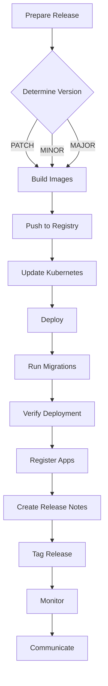

# Release Workflow Skill Demo

This document demonstrates how to use the release workflow skill step by step.

## Demo Scenario

Let's walk through a complete release cycle for LWP version 1.0.1.

## Step 1: Prepare the Release

```bash
# Navigate to the project directory
cd /opt/lwp

# Check what changes have been made since the last release
git log --oneline --since="$(git describe --tags --abbrev=0)"..HEAD

# Sample output:
# 3a1b2c3 Fix session timeout issue
# 4d5e6f7 Fix clipboard sync in Firefox
# 8g9h0i1 Update dependencies
```

## Step 2: Determine Version Bump

```bash
# Based on the changes, determine version type:
# - Bug fixes only → PATCH version (1.0.1)
# - New features → MINOR version (1.1.0)
# - Breaking changes → MAJOR version (2.0.0)

VERSION="1.0.1"
echo "Preparing release $VERSION"
```

## Step 3: Run Dry Run

```bash
# Test the release process without making changes
./skills/release-workflow/scripts/release.sh --version $VERSION --dry-run

# Sample output:
# [DRY RUN] docker build -t registry.example.com/lwp/backend:1.0.1 backend/
# [DRY RUN] docker build -t registry.example.com/lwp/frontend:1.0.1 frontend/
# [DRY RUN] make base REGISTRY=registry.example.com TAG=1.0.1
# [DRY RUN] make all REGISTRY=registry.example.com TAG=1.0.1
# ...
```

## Step 4: Execute the Release

```bash
# Now run the actual release
./skills/release-workflow/scripts/release.sh --version $VERSION

# This will:
# 1. Build backend and frontend images
# 2. Build base container image
# 3. Build all app container images
# 4. Push all images to registry
# 5. Update Kubernetes manifests
# 6. Deploy to Kubernetes
# 7. Run database migrations
# 8. Verify deployment
```

## Step 5: Verify Deployment

```bash
# Run comprehensive verification
./skills/release-workflow/scripts/verify.sh

# Sample output:
# ✓ All pods are running
# ✓ Backend service is available
# ✓ Frontend service is available
# ✓ Nginx service is available
# ✓ Health endpoint is healthy
# ✓ Database connection is working
# ✓ Redis connection is working
# ✓ Database migrations are up to date
# ✓ All required container images are available
# 
# All checks passed!
# Deployment is healthy and ready for use.
```

## Step 6: Register App Images

```bash
# Log in to the admin panel
# Navigate to Apps → Add App

# Add each app with:
# - Container image: registry.example.com/lwp/{app}:1.0.1
# - Proxy port: 8080
# - App type: stream
# - SHM size: 1Gi

# Apps to register:
# - firefox
# - vivaldi
# - thunderbird
# - libreoffice
# - terminator
# - sshpilot
# - vscodium
# - filezilla
# - headlamp
# - remmina
# - ferdium
# - htop
# - jupyterlab
# - pgweb
# - opencode
# - vpn

# After adding each app, click "Pull image" to pre-pull on all nodes
```

## Step 7: Create Release Notes

```bash
# Use the changelog template
cp skills/release-workflow/templates/CHANGELOG.md .

# Edit the changelog with the new release
cat >> CHANGELOG.md << 'EOF'

## [1.0.1] - $(date +%Y-%m-%d)

### Fixed
- Fixed session timeout issue
- Fixed clipboard sync in Firefox
- Improved VPN connection stability

### Changed
- Updated dependencies to latest versions
- Improved error handling in session management

### Technical
- Backend: Fixed race condition in session cleanup
- Frontend: Improved clipboard synchronization
- Database: Added index for session queries
EOF
```

## Step 8: Tag the Release

```bash
# Create a git tag for the release
git tag -a v$VERSION -m "Release $VERSION"

# Push the tag to remote
git push origin v$VERSION
```

## Step 9: Monitor Deployment

```bash
# Check Prometheus metrics
curl -s http://prometheus.example.com/api/v1/query?query=lwp_active_sessions

# Check Kubernetes metrics
kubectl top pods -n lwp

# Check session creation rate
kubectl logs -n lwp deploy/backend | grep -i "session created" | wc -l

# Check authentication success rate
kubectl logs -n lwp deploy/backend | grep -i "auth success" | wc -l
```

## Step 10: Communicate Release

```bash
# Notify the team
cat > RELEASE_NOTIFICATION.md << 'EOF'
📢 LWP Release 1.0.1 Deployed

Deployed to production: https://lwp.example.com

### Changes
- Fixed session timeout issue
- Fixed clipboard sync in Firefox  
- Updated dependencies

### Verification
✓ All tests passed
✓ Deployment healthy
✓ Migrations completed
✓ App images registered

### Rollback Plan
Previous version: 1.0.0
Rollback command: kubectl rollout undo deployment/backend -n lwp
EOF

# Send notification to team channel
# Post to Slack/Mattermost/Teams
# Update status page
```

## Complete Workflow Summary



## Common Variations

### Fast Patch Release
```bash
# Quick patch for critical bug
VERSION=$(echo "1.0.0" | awk -F. '{print $1 "." $2 "." $3+1}')
./skills/release-workflow/scripts/release.sh --version $VERSION
./skills/release-workflow/scripts/verify.sh
```

### Feature Release
```bash
# New features
VERSION=$(echo "1.0.0" | awk -F. '{print $1 "." $2+1 ".0"}')
./skills/release-workflow/scripts/release.sh --version $VERSION
# Test thoroughly in staging
# Deploy to production
```

### Emergency Security Release
```bash
# Security patch
VERSION=$(echo "1.0.0" | awk -F. '{print $1 "." $2 "." $3+1}')
./skills/release-workflow/scripts/release.sh --version $VERSION --dry-run
./skills/release-workflow/scripts/release.sh --version $VERSION
# Immediate verification and monitoring
```

## What to Watch For

1. **Build failures**: Check Docker build logs
2. **Push failures**: Verify registry credentials
3. **Deployment issues**: Check Kubernetes events
4. **Migration errors**: Review alembic history
5. **App registration**: Verify images are pulled
6. **Health checks**: Monitor Prometheus metrics

## Next Steps

- Review deployment metrics
- Monitor user feedback
- Plan next release
- Update documentation
- Prepare for future enhancements
